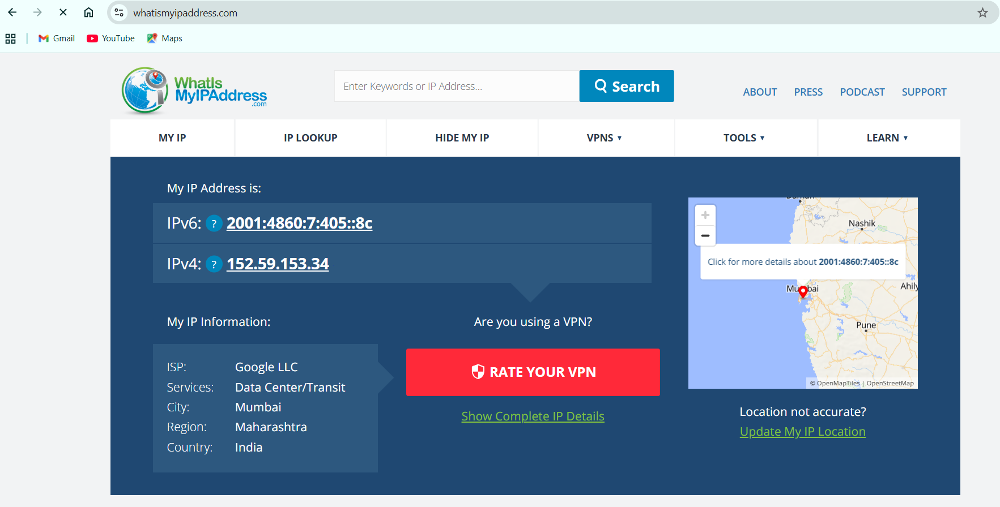
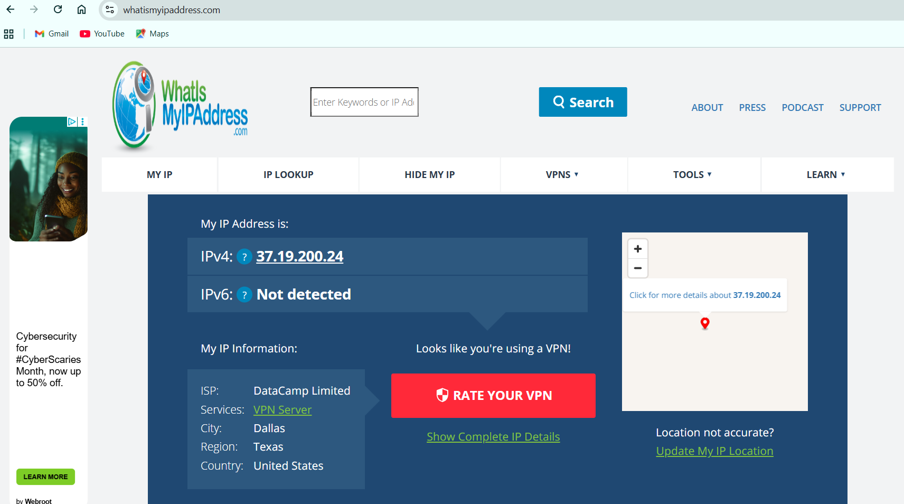

## Objective
Understand the role of VPNs in protecting privacy and ensuring secure communication.

## Tools Used
- ProtonVPN (free tier) 
- Web browser  
- IP verification: [whatismyipaddress.com](https://www.whatismyipaddress.com)

## Steps Followed
1. **Choose VPN Service:**  
   - Signed up for a free account on ProtonVPN

2. **Download & Install Client:**  
   - Downloaded ProtonVPN from official website and installed it.

3. **Connect to VPN Server:**  
   - Logged in, selected a server, and connected.

4. **Verify IP Address Change:**  
   - Checked IP before and after connecting to VPN.  
   - Confirmed IP reflected VPN server location.  
   

5. **Test Encrypted Traffic:**  
   - Browsed websites to ensure secure traffic.  
   

6. **Disconnect VPN & Compare:**  
   - Compared browsing speed and original IP with VPN connection.

7. **Research VPN Encryption & Privacy:**  
   - Traffic encrypted between device and VPN server.  
   - IP hidden from websites and network providers.  
   - Protection over public Wi-Fi.

## VPN Benefits
- Hides IP and browsing activity for privacy.  
- Encrypts data for secure communication.  
- Bypasses geo-restrictions for content access.  
- Safer usage on public Wi-Fi networks.

## VPN Limitations
- May reduce internet speed slightly.  
- Free VPNs may log some user data.  
- Limited server locations on free tier.  
- Does not guarantee full anonymity.

## Deliverables
- Screenshot of VPN connection status: ``  
- IP address verification screenshot: ``  
